<p align="center">
  
</p>

<h1 align="center">mcp-code-editor</h1>

<p align="center">
  An AI agent can read, edit, build and test a project directly on disk through a local MCP server,
  OAuth 2.1 and an HTTPS Cloudflare Tunnel.
</p>

## 1. Overview

**mcp-code-editor** is a Windows desktop application for connecting an AI agent — through a web AI chat or local MCP client — to a real project on disk.

### Features

- No account or sign-up.
- No copy-paste of source fragments.
- Project-wide code access: files, classes, data and relationships.
- **Read-Only** and **Read-Write** access modes.
- Local MCP server bound to `127.0.0.1`.
- Public HTTPS endpoint through Cloudflare Tunnel.
- OAuth 2.1 authentication implemented by the server.
- Human approval for arbitrary commands by default.
- Append-only JSONL audit log for writes and deletes.
- Automatic application updates.

## 2. Requirements

- Windows 10/11 x64
- PowerShell
- Internet access for the public tunnel

No .NET SDK, administrator rights or separate installer are required. The application is self-contained; Cloudflared is downloaded by the bootstrap process.

## 3. Installation

Run in PowerShell:

```powershell
irm https://raw.githubusercontent.com/DomitorAI/mcp-code-editor/main/scripts/bootstrap.ps1 | iex
```

The bootstrap installs the application and Cloudflared under:

```text
%LOCALAPPDATA%\mcp-code-editor\
```

A **mcp-code-editor** desktop shortcut is created automatically.

## 4. Start and Project Selection

1. Launch **mcp-code-editor**.
2. On **Project**, press **Browse...** and select the project.
3. On **Mode**, select:
   - **Read-Write** — file modifications are available.
   - **Read-Only** — only read/search operations are exposed.
4. Configure **Tunnel** if a named tunnel is required.
5. Press **Start**.
6. Copy the public URL from **Endpoint**.

The control window contains:

**Project → Mode → Update → Start/Stop + Feedback → Endpoint → Tunnel → Status → Uninstall**

<p align="center">
  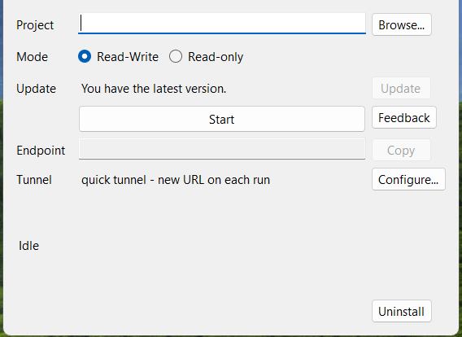
</p>

## 5. Connect an MCP Client

The MCP endpoint is:

```text
<public-endpoint>/mcp
```

Configure the AI chat or local MCP client with this endpoint. OAuth 2.1 authentication is completed by the server.

Custom MCP endpoint support depends on the client. If a web AI client does not support custom MCP servers, use a local MCP client on the same machine.

### ChatGPT

The following screenshots document the ChatGPT web setup shown by the application documentation. ChatGPT interface names and locations may change.

1. Open the account menu and select **Settings**.

<p align="center">
  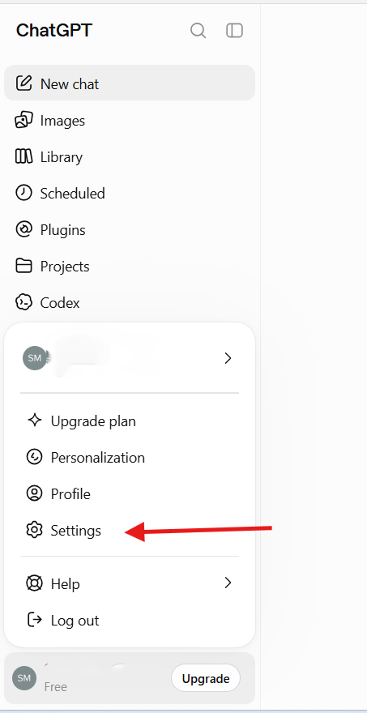
</p>

2. In **Settings → Plugins**, open **Developer mode**.

<p align="center">
  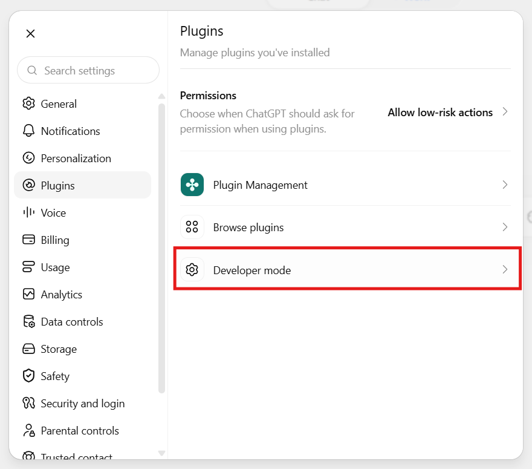
</p>

3. Enable **Developer mode**. This allows unverified connectors and displays an **ELEVATED RISK** warning.

<p align="center">
  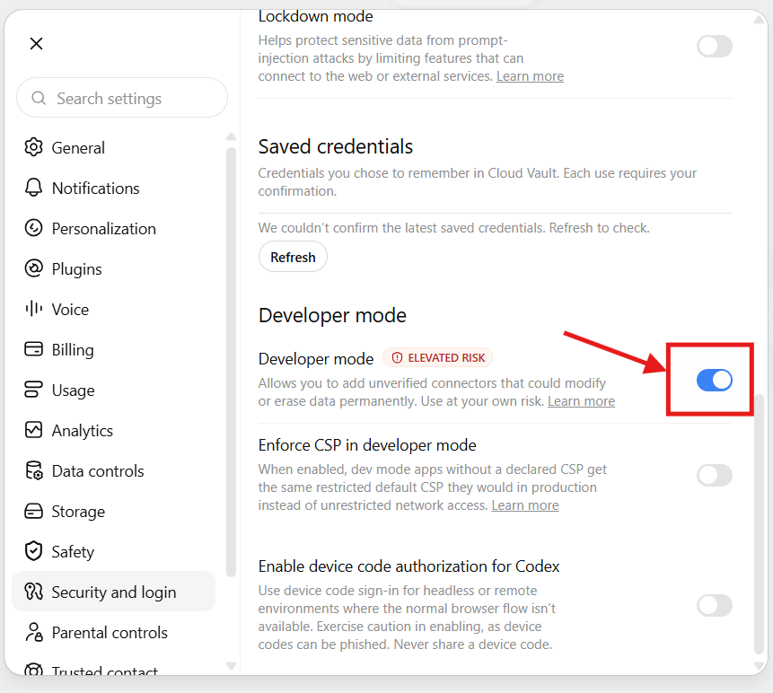
</p>

4. Open **Plugins** and press **+**.

<p align="center">
  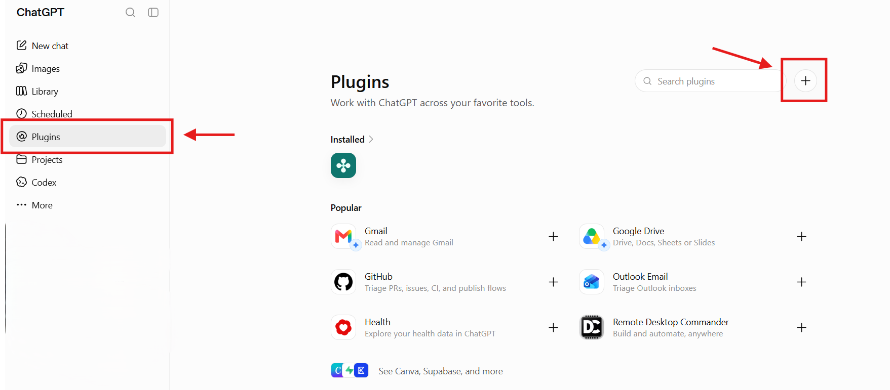
</p>

5. Enter a connector name and the current **Endpoint** as **Server URL**. Keep **Authentication: OAuth** and confirm the acknowledgement.

<p align="center">
  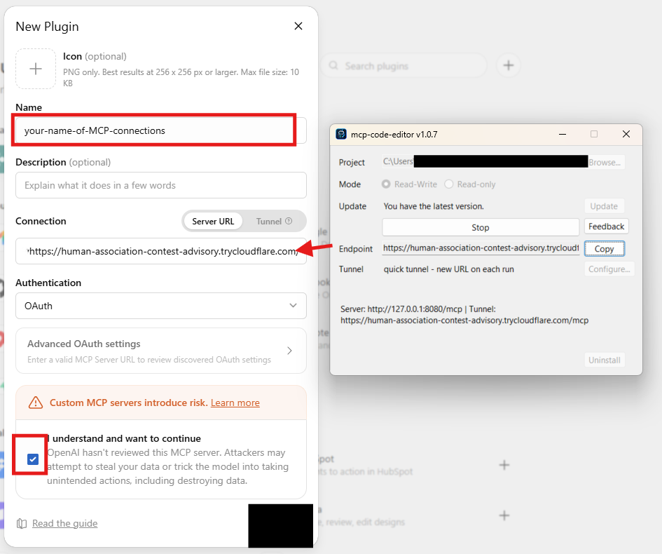
</p>

6. On the OAuth consent screen, press **Sign in with your-name-of-MCP-connections**.

<p align="center">
  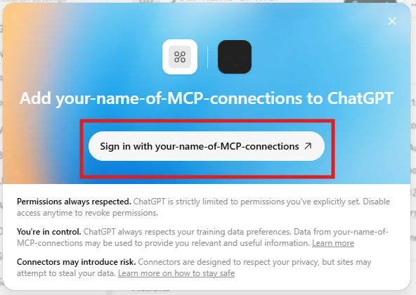
</p>

7. In **Settings → Plugins**, open the connector. The connected account is listed, and the **⋯** menu offers **Reconnect**, **Disconnect** and **Delete**.

<p align="center">
  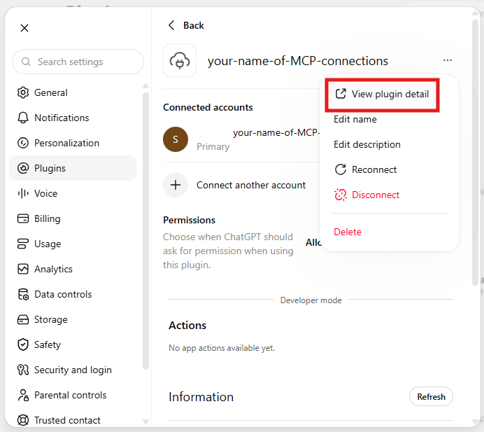
</p>

8. Press **View plugin detail**, then **Try in chat**.

<p align="center">
  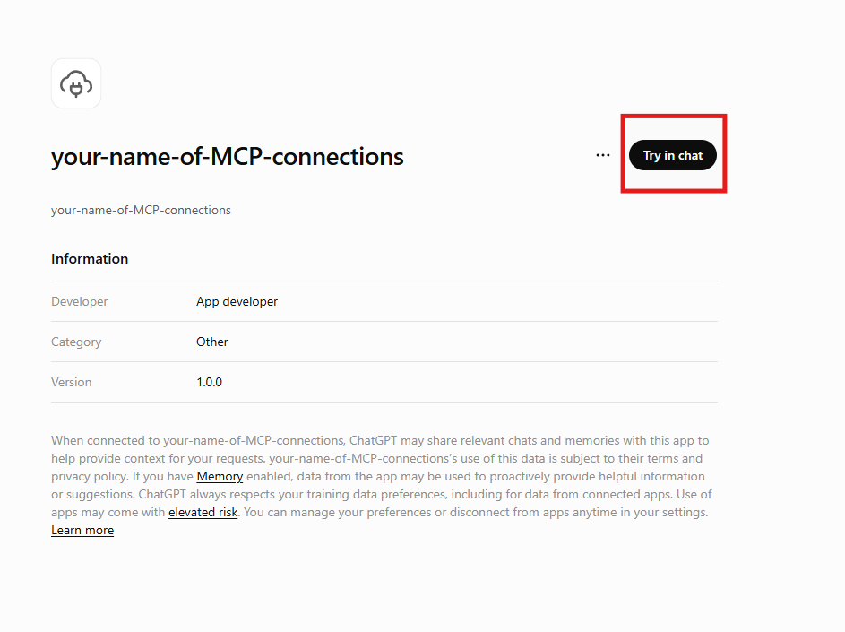
</p>

9. A new chat tab opens. Close the **Meet ChatGPT Work** panel with the **X** button in the top-right corner. The connector is ready to use in chat.

<p align="center">
  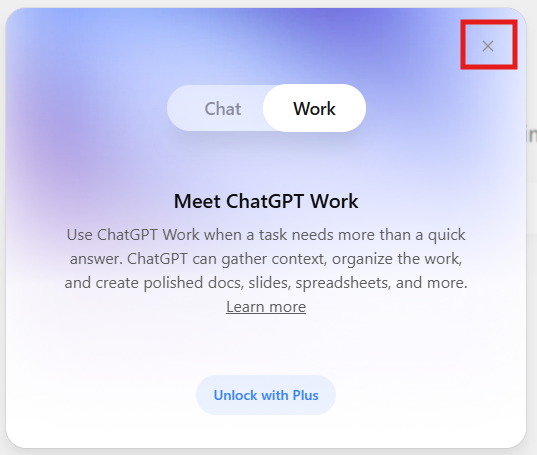
</p>

10. In the new chat, the connector is attached to the input box. Type your request and send it.

<p align="center">
  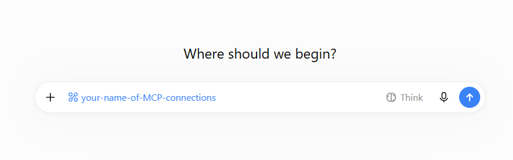
</p>

### If the application is stopped and started again

With a **Quick Tunnel**, every new application start creates a new public HTTPS URL. The previous URL is no longer valid.

This is important for web-based MCP connectors: the connector keeps the old server URL and OAuth origin. After the application starts again, it still points to the previous Quick Tunnel URL, so the connector cannot reach the new server.

To reconnect:

1. Press **Stop**, then **Start** in **mcp-code-editor**.
2. Copy the new URL from **Endpoint**.
3. In ChatGPT, open **Settings → Plugins** and find the existing connector.
4. Open the **⋯** menu and select **Delete**.
5. Create the connector again using the new **Endpoint** as **Server URL**.
6. Complete the OAuth authorization again.

<p align="center">
  
</p>

> **Why delete the connector?** A Quick Tunnel URL is temporary and changes on every start. The existing connector is configured for the old URL, and OAuth tokens are bound to the previous endpoint origin. Recreating the connector makes ChatGPT use the new URL and perform the OAuth handshake for that endpoint.

For a **Named Tunnel**, the configured public hostname remains stable between application restarts, so this delete-and-recreate step is normally not required.

## 6. Using the Agent

First identify the project when required:

```text
Work on C:\path\to\your-project
```

Typical requests:

```text
Fix the bug in X.
Add feature Y.
Run the tests.
```

The agent can read/search the project, edit files, build/test the project and report results.

Review the result with Git before committing or pushing:

```powershell
git diff
```

The user remains responsible for prompts, requested changes, commits and pushes.

## 7. MCP Tools

| Tool | Function |
|---|---|
| `list_projects` | Lists registered project aliases. |
| `list_files` | Walks the project tree using a glob pattern and depth limit. |
| `read_file` | Reads a text file with numbered lines and pagination. |
| `search_code` | Regex search across the project. |
| `edit_file` | Exact snippet replacement; the match must be unique. |
| `write_file` | Creates or overwrites a UTF-8 file, subject to size limits. |
| `delete_file` | Deletes one file; folders cannot be deleted. |
| `run_build` | Runs `dotnet build` in the project root. |
| `run_tests` | Runs `dotnet test`; VSTest `--filter` is supported. |
| `run_command` | Runs an arbitrary command in the project root; approval policy applies. |

All tools accept an optional `project` alias.

Aliases are registered in `config.json` under `projects` and `defaultProject`. The **Project** row selects the default alias.

Responses use:

```json
{"ok": true, "...": "..."}
```

or:

```json
{"ok": false, "error": "..."}
```

## 8. Tunnels

The **Tunnel → Configure...** settings select between a quick tunnel and a named tunnel. Settings are stored in local `config.json`; the Cloudflare token remains on the local machine.

| | Quick tunnel (default) | Named tunnel |
|---|---|---|
| Cloudflare account | Not required | Your own account |
| Public URL | Random `*.trycloudflare.com`, new on every start | Configured hostname, stable |
| Local port | Automatically selected, 8080–8180 | Fixed, default 8080 |
| Setup | None | Cloudflare tunnel + Public Hostname |
| Backend target | Selected local port | `http://localhost:8080` by default |
| Best for | Testing / occasional use | Persistent MCP connection |

### Quick tunnel

Leave the Tunnel configuration fields empty.

Each start creates a new public URL. The previous URL becomes invalid.

For a local MCP client, update its configured URL.

For a web connector, delete the stale connector and create a new one using the current Endpoint.

### Named tunnel

Configure a Cloudflare token and hostname once. The public hostname remains stable between application restarts, so an existing MCP connector can continue using the same URL.

The fixed local port is 8080 by default. Starting fails if that port is already in use.

### Tunnel failure

If Cloudflared stops while the application is running:

- the **Endpoint** row is cleared;
- Status reports that the public URL is no longer valid;
- press **Stop**, then **Start**.

On startup, the application removes orphaned Cloudflared processes from previous runs. Status reports the number removed.

## 9. OAuth 2.1

The server implements OAuth 2.1 natively; no external authorization service is required.

- Clients self-register through Dynamic Client Registration: `POST /oauth/register`.
- Authorization is automatically approved.
- Access tokens are JWTs using **RS256** and expire after **1 hour**.
- Refresh tokens are one-shot.
- **Public clients** use Proof Key for Code Exchange (**PKCE**); loopback redirects are supported for local clients.
- **Confidential clients** support `client_secret_basic` and `client_secret_post`.
- **CIMD** (Client ID Metadata Document) is supported. A client ID may be the URL of a public metadata document.
- CIMD fetching uses public hosts only, no redirects, and size/time limits as an SSRF protection.
- Protected-resource metadata is published at `/.well-known/oauth-protected-resource`.
- Tokens are bound to the endpoint origin. A token issued for a previous quick-tunnel URL is rejected when the endpoint URL changes.

## 10. Security

### Project boundaries

- The agent writes freely only inside the active project.
- Absolute paths are considered outside the project for write operations and require approval.
- `denySegments` blocks both reads and writes for:
  - `.git`
  - `bin`
  - `obj`
  - `.vs`
  - `node_modules`
- Restrictions also apply through absolute paths and symlinks/junctions.
- Every write, overwrite and delete is recorded in the append-only audit log.

### Read-Only mode

Read-Only mode exposes read/search tools only. File modifications are refused.

Use it for projects that should be inspected without allowing agent changes.

### Command approval

`run_command` executes as the current Windows user, in the project root, with that user's OS permissions.

Default:

```text
commands.approval = always
```

Every `run_command` request is shown in the application for approval.

- Approval timeout: **60 seconds**
- Timeout result: **automatic deny**

Supported policies:

| Policy | Behavior |
|---|---|
| `always` | Every `run_command` requires approval. |
| `onOutsidePath` | Commands staying inside the project auto-approve; commands that appear to reach outside require approval. |
| `never` | No approval dialog is used. |

Policy values are case-insensitive. An invalid value is a startup configuration error.

With `onOutsidePath`, the following continue to require approval when detected:

- absolute/UNC paths;
- environment variables;
- nested shells;
- inline or encoded code;
- network tools;
- registry access;
- destructive verbs.

Commands are single-line. Newlines, control characters and invisible Unicode are rejected. Use `&&` for command chaining.

The policy is a **guardrail, not a sandbox**.

`run_build` and `run_tests` are fixed commands and do not use the `run_command` approval dialog.

### Network exposure

The MCP server binds to `127.0.0.1` only.

The public endpoint is provided by Cloudflared:

- quick tunnel: random public subdomain;
- named tunnel: configured hostname.

The public endpoint exists only while the application/tunnel is running.

### Prompt injection

The agent receives instructions from the AI chat and may also encounter instructions in project content. Adversarial content can attempt to influence requested operations.

For sensitive projects, use `http.readOnly: true` / **Read-Only** mode.

### Responsibility

The agent acts on the user's instructions. Review the resulting changes, `git diff` and audit log before keeping them.

Keep the project under Git so changes can be reviewed and undone.

## 11. Configuration and Local Data

Local application data is stored under:

```text
%LOCALAPPDATA%\mcp-code-editor\
```

Important files include:

| File | Purpose |
|---|---|
| `config.json` | Project aliases, default project, tunnel and command policy configuration. |
| `mcp.oauth.json` | OAuth RSA key and OAuth state/tokens. |
| `audit.log` | Append-only JSONL audit log. |

## 12. Auto-Update

The installed application checks GitHub Releases at startup.

- Release check: `releases/latest`, with a **10-second timeout**.
- Offline/errors/missing assets do not block application startup.
- **Update** is enabled only when a newer version exists and the server is stopped.
- The update downloads `mcp-code-editor-win-x64.zip` to a temporary folder.
- A temporary external `.cmd` script replaces the locked application files and restarts the application.
- Progress is shown on **Status**.

If the application does not restart automatically, start it manually.

Update log:

```text
%TEMP%\mcp-code-editor-update.log
```

The update archive contains only application binaries. These remain unchanged:

- `config.json`
- `mcp.oauth.json`
- `audit.log`

Because the OAuth key is preserved, existing authorized clients/tokens remain valid and do not require re-authorization.

Self-update is available only in the installed build. A development build run from `bin\` reports that self-update is unavailable.

### Update failure

If download, antivirus/SmartScreen or file replacement fails:

- the old version remains active;
- binary replacement is retried up to 3 times;
- repeat **Update** or rerun the bootstrap if necessary;
- temporary update folders are cleaned at the next startup.

## 13. Troubleshooting

### Tunnel stopped

Press **Stop**, then **Start**.

A quick tunnel generates a new Endpoint URL.

### Quick-tunnel connector stopped working

The URL changes on every start. Update the URL in a local MCP client, or delete/recreate the web connector with the new Endpoint.

### OAuth token rejected after restart

With a quick tunnel, tokens are bound to the previous endpoint origin. Re-authorize the client against the new URL.

### Command was denied

Approve the command in the application window before the 60-second timeout.

### Named tunnel cannot start

Verify that the configured fixed local port (8080 by default) is available and that the Cloudflare token/hostname configuration is valid.

### MCP client cannot connect

Verify:

- application is running;
- Endpoint is current;
- client uses `<endpoint>/mcp`;
- OAuth authentication is enabled;
- the client supports custom MCP endpoints.

## 14. Uninstall

### From the application

1. Stop the server.
2. Press **Uninstall**.
3. Confirm.

The button is available only when the server is stopped and only in the installed build.

### PowerShell

If the application no longer opens:

```powershell
irm https://raw.githubusercontent.com/DomitorAI/mcp-code-editor/main/scripts/uninstall.ps1 | iex
```

Both methods remove:

```text
%LOCALAPPDATA%\mcp-code-editor\
Desktop shortcut
Temporary application files
```

The uninstall process:

- keeps **Cloudflared**;
- never modifies project source code;
- creates no Windows service;
- creates no registry entries;
- makes no PATH changes.

If an item remains locked by Explorer or antivirus software, rerun the uninstall script.

## 15. Feedback

- [Report a bug or request a feature](https://github.com/DomitorAI/mcp-code-editor/issues)
- [Start a discussion](https://github.com/DomitorAI/mcp-code-editor/discussions)
- Press **Feedback** in the application.

## 16. License

All rights reserved — see [LICENSE](LICENSE).
