<p align="center">
  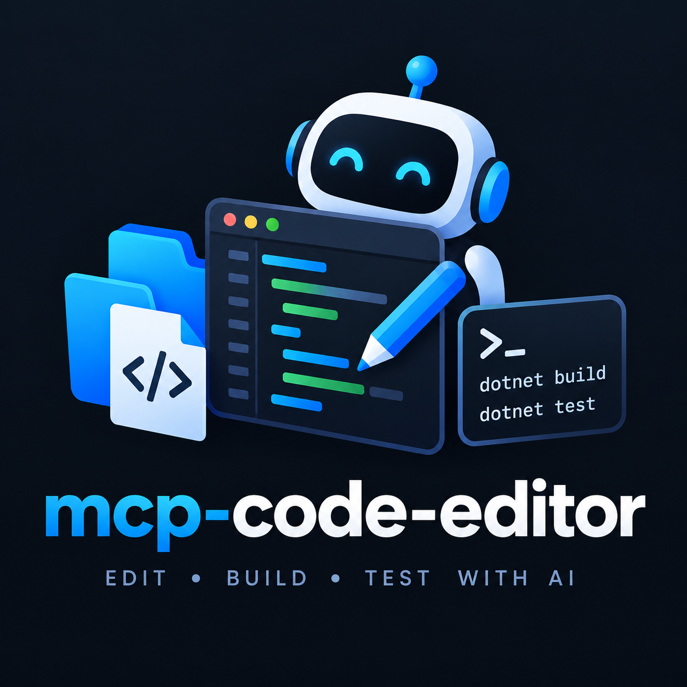
</p>

<h1 align="center">mcp-code-editor</h1>

<p align="center">
  Let an AI agent read, edit, build and test your project directly on disk —
  from a web AI chat or a local MCP client.
</p>

## 1. Overview

**mcp-code-editor** is a Windows desktop application that connects an AI agent to a real project on your computer. No copy-paste of code fragments: the agent works on the project itself, and you review the result with Git.

### Features

- No account or sign-up.
- The agent sees the whole project: files, code structure, compiler errors, references between symbols (C#, Python, JavaScript/TypeScript, HTML, CSS).
- The agent can view screenshots and diagrams from the project.
- **Read-Only** and **Read-Write** modes.
- Every command the agent wants to run is shown to you for approval (default).
- Secret files (`.env`, keys, certificates) are hidden from the agent by default.
- Files ignored by `.gitignore` are hidden from listings and searches.
- Every file change is recorded in an audit log.
- Public HTTPS endpoint through Cloudflare Tunnel, protected by OAuth 2.1.
- One window per project; several projects can run in parallel.
- Automatic updates.

<p align="center">
  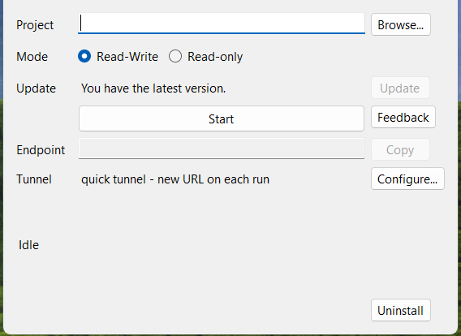
</p>

## 2. Requirements

- Windows 10/11 x64
- PowerShell
- Internet access

No administrator rights, .NET installation or separate installer are required.

Optional, for code intelligence (compiler errors, go-to-definition, references):

- C# — an installed .NET SDK.
- Python / JavaScript / TypeScript / HTML / CSS — the matching language server on `PATH`: `pyright-langserver`, `typescript-language-server`, `vscode-html-language-server`, `vscode-css-language-server`.

Without them, everything else keeps working; the agent is told that code intelligence is unavailable for that language.

## 3. Installation

Run in PowerShell:

```powershell
irm https://raw.githubusercontent.com/DomitorAI/mcp-code-editor/main/scripts/bootstrap.ps1 | iex
```

The application and Cloudflared are installed under `%LOCALAPPDATA%\mcp-code-editor\`, and a **mcp-code-editor** desktop shortcut is created.

## 4. Start

1. Launch **mcp-code-editor**.
2. On **Project**, press **Browse...** and select the project folder.
3. On **Mode**, select **Read-Write** or **Read-Only**.
4. Optional: on **Tunnel**, press **Configure...** to use a named tunnel (see below).
5. Press **Start**.
6. Copy the public URL from **Endpoint**.

To work on several projects at the same time, open one window per project. The same project cannot be opened in two windows.

## 5. Tunnels

| | Quick tunnel (default) | Named tunnel |
|---|---|---|
| Cloudflare account | Not required | Your own account |
| Public URL | Random `*.trycloudflare.com`, new on every start | Your hostname, stable |
| Setup | None | Cloudflare tunnel + public hostname, entered once in **Tunnel → Configure...** |
| Best for | Testing, occasional use | Everyday use with a saved connector |

The Cloudflare token stays on your computer.

### If the public URL stops working

- If Cloudflared stops, the **Endpoint** row is cleared and Status says so. Press **Stop**, then **Start**.
- If the URL stops responding while the application is running (e.g. after sleep), the application notices within about a minute: Status turns red, the taskbar button flashes and a sound plays. If the URL recovers by itself, the warning clears.
- Right after **Start**, a new quick-tunnel URL can take a minute or two to become reachable; the warning waits for it.

## 6. Connect an MCP Client

Use the **Endpoint** URL as the MCP server URL in your AI chat or local MCP client, with **OAuth** authentication. Support for custom MCP servers depends on the client.

### ChatGPT

ChatGPT menu names and locations may change.

1. Open the account menu and select **Settings**.

<p align="center">
  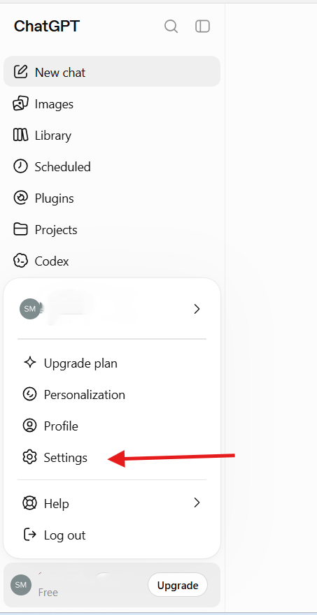
</p>

2. In **Settings → Plugins**, open **Developer mode**.

<p align="center">
  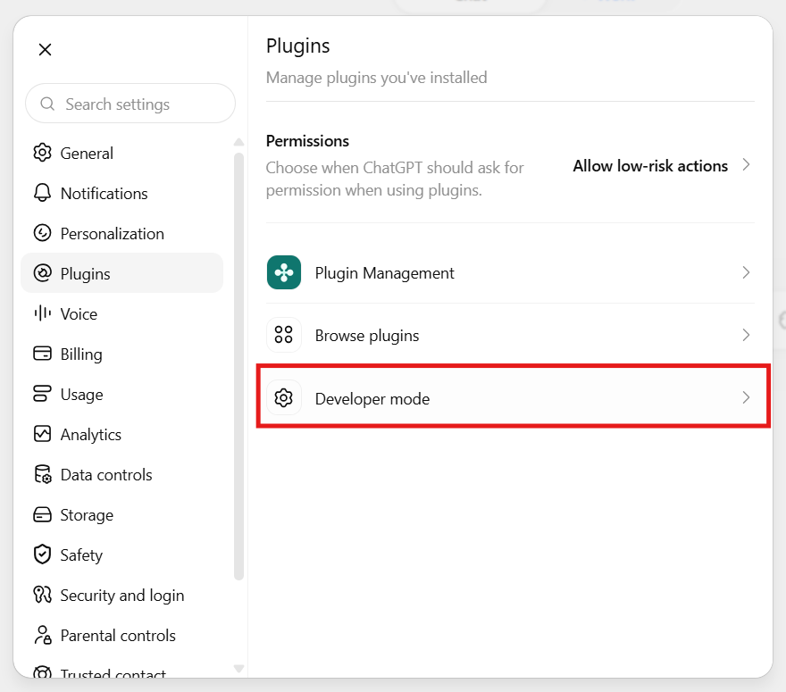
</p>

3. Enable **Developer mode**. This allows unverified connectors and displays an **ELEVATED RISK** warning.

<p align="center">
  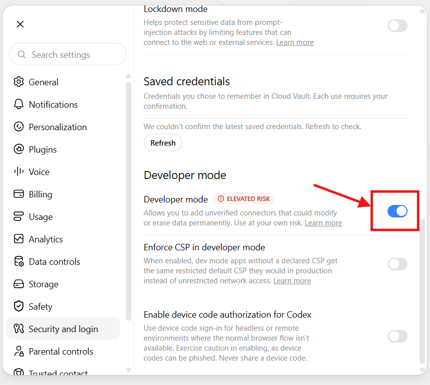
</p>

4. Open **Plugins** and press **+**.
   - If the connector form opens, continue with step 5.
   - If a menu opens instead, select **Create app**. In the **New Plugin** window that follows, do not upload anything — press **Create MCP App** at the bottom left. The connector form (step 5) opens.

<p align="center">
  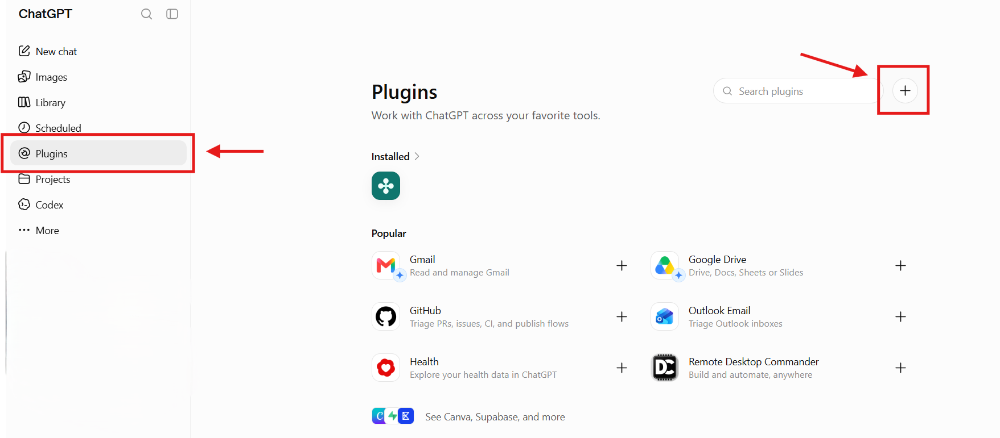
</p>

<p align="center">
  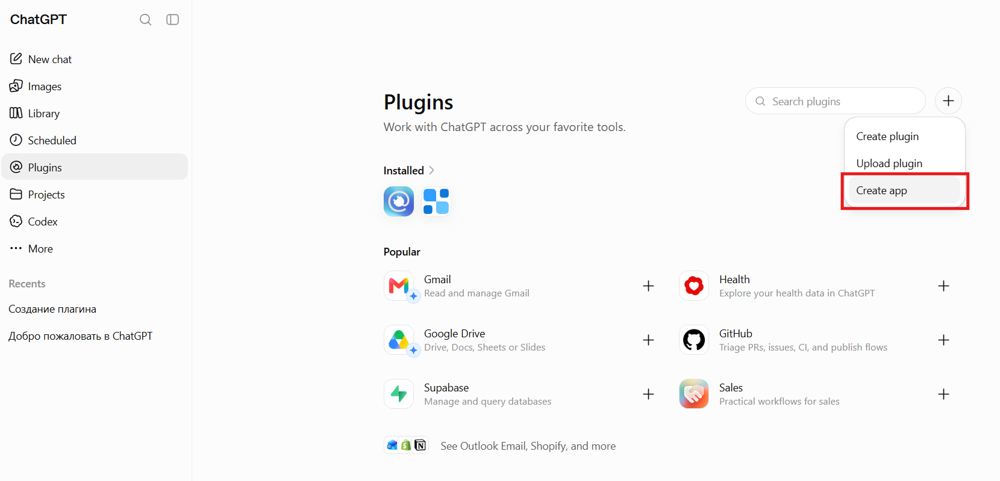
</p>

<p align="center">
  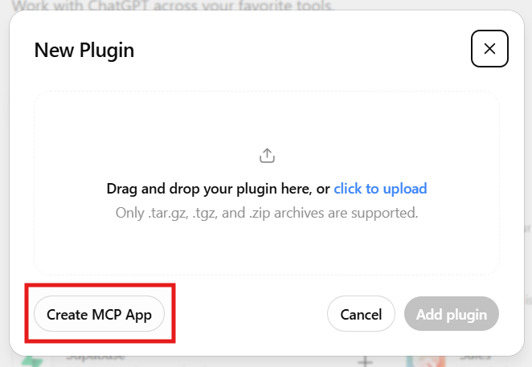
</p>

5. Enter a connector name and the current **Endpoint** as **Server URL**. Keep **Authentication: OAuth** and confirm the acknowledgement.

<p align="center">
  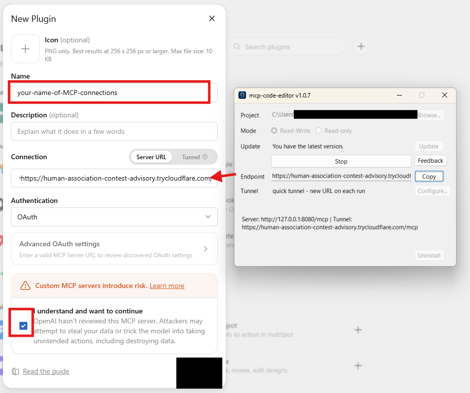
</p>

6. On the consent screen, press **Sign in with your-name-of-MCP-connections**.

<p align="center">
  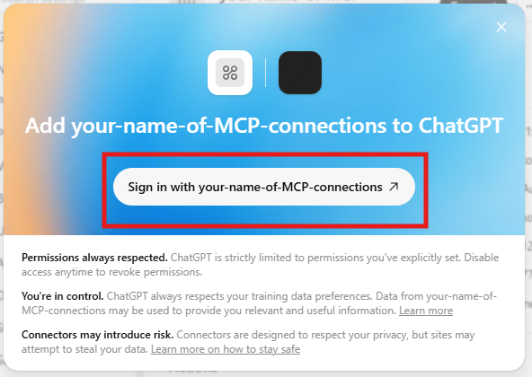
</p>

7. In **Settings → Plugins**, open the connector. The **⋯** menu offers **Reconnect**, **Disconnect** and **Delete**.

<p align="center">
  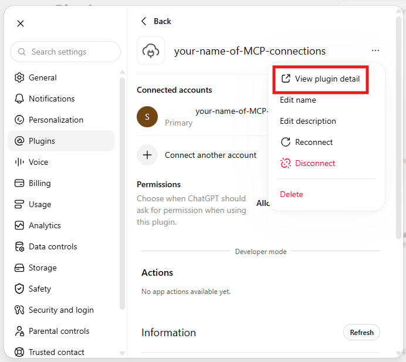
</p>

8. Press **View plugin detail**, then **Try in chat**.

<p align="center">
  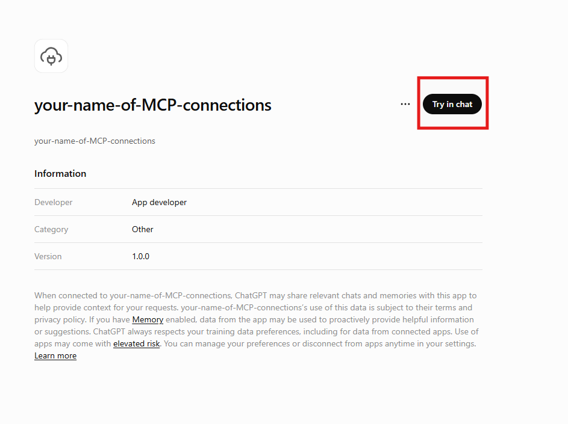
</p>

9. A new chat opens. Close the **Meet ChatGPT Work** panel with the **X** in the top-right corner.

<p align="center">
  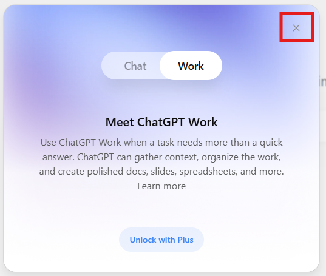
</p>

10. The connector is attached to the input box. Type your request and send it.

<p align="center">
  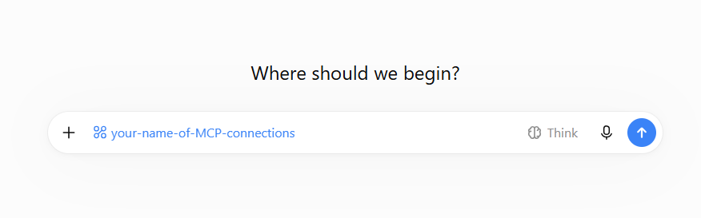
</p>

### After a restart (quick tunnel)

Every start of a quick tunnel creates a new URL, and the saved connector still points to the old one. To reconnect:

1. Copy the new URL from **Endpoint**.
2. In ChatGPT, open **Settings → Plugins** and find the existing connector.

<p align="center">
  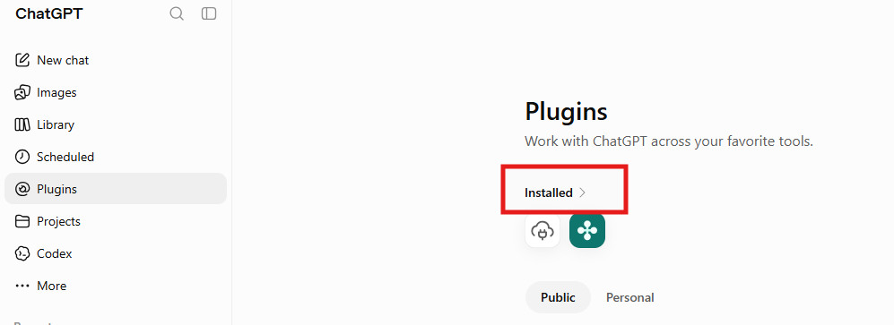
</p>

<p align="center">
  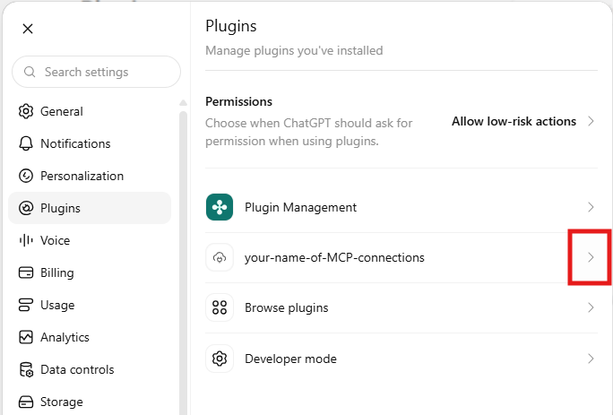
</p>

3. Open the **⋯** menu and select **Delete**.

<p align="center">
  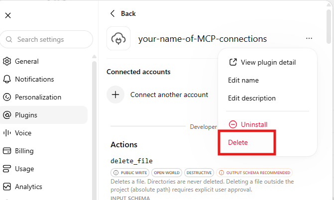
</p>

4. Create the connector again with the new **Endpoint** ([steps 4–10](#chatgpt) above) and sign in again.

With a **named tunnel**, the URL does not change, so this is not needed.

## 7. Using the Agent

Tell the agent which project to work on, if needed:

```text
Work on C:\path\to\your-project
```

Then ask as you would ask a developer:

```text
Fix the bug in X.
Add feature Y.
Run the tests.
Look at the screenshot docs/login.png and fix the layout.
```

The agent reads and searches the project, edits files, builds and tests it, and reports back. Review the result before committing:

```powershell
git diff
```

You remain responsible for the prompts, the changes you keep, and your commits and pushes.

### What the agent can do

| Tool | What it does |
|---|---|
| `list_projects` | Lists the available projects. |
| `list_files` | Lists files and folders. |
| `read_file` | Reads a text file. |
| `read_image` | Views an image (PNG, JPEG, GIF, WebP). |
| `search_code` | Searches the project text. |
| `edit_file` | Changes a precise piece of a file. |
| `write_file` | Creates or replaces a file. |
| `delete_file` | Deletes a file (never a folder). |
| `run_build` / `run_tests` | Builds / tests a .NET project. |
| `run_command` | Runs any other command (build, test, lint) — after your approval. |
| `get_diagnostics` | Lists compiler errors. |
| `go_to_definition` / `find_references` / `get_symbol_info` | Navigates the code like an IDE. |

In **Read-Only** mode, only the reading, searching and code-navigation tools are available.

## 8. Security

### What the agent can reach

- The agent works freely only inside the selected project folder. Changing anything outside it requires your approval.
- `.git`, `bin`, `obj`, `.vs` and `node_modules` are off limits.
- Secret files are hidden from the agent — it cannot read, search, change or delete them: `.env` files, private keys and certificates (`*.pem`, `*.key`, `*.pfx`, `id_rsa`, ...), credential files (`.npmrc`, `.git-credentials`, `secrets.json`, ...). Templates such as `.env.example` stay visible. The list can be changed in `config.json` (see [docs/technical.md](docs/technical.md)).
- Outside the project, credential folders (`.ssh`, `.aws`, `.azure`, ...) and the application's own folder are blocked.
- Files that are not UTF-8 text (binary files, old code pages) are never rewritten by the agent, so they cannot be damaged by an edit.
- Every change is recorded in an audit log.

### Command approval

By default, every command the agent wants to run is shown to you first — the dialog appears on top of all windows, even when the application is minimized. Commands run as your Windows user, in the project folder, with your permissions.

- No answer within **60 seconds** means **deny**.
- `run_build` and `run_tests` run fixed .NET commands without a dialog.

The policy is set in `config.json` (`commands.approval`):

| Policy | Behavior |
|---|---|
| `always` (default) | Every command requires approval. **The only setting that protects you against a manipulated agent.** |
| `onOutsidePath` | Commands that look like they stay in the project run without asking. A convenience, not a protection. |
| `never` | No approval. Use only on a trusted, local setup. |

### Network exposure

The server listens only on your computer (`127.0.0.1`). It is reachable from the internet only through the tunnel, only while the application is running, and only after OAuth sign-in.

### Prompt injection

Project content — files, comments, images — can contain text written to manipulate the agent. Treat such text as data, not as instructions. For projects you do not trust, use **Read-Only** mode and keep command approval on `always`.

### Responsibility

The agent acts on your instructions. Keep the project under Git, and review the changes (`git diff`) and the audit log before keeping them.

## 9. FAQ and Troubleshooting

**The connector stopped working after I restarted the application.**
With a quick tunnel the URL changes on every start; recreate the connector with the new Endpoint ([After a restart](#after-a-restart-quick-tunnel)). A named tunnel avoids this.

**The client says its sign-in is no longer valid.**
Sign-ins are tied to the URL. After a quick-tunnel restart, sign in again with the new URL.

**My client cannot connect.**
Check that the application is running, the URL is the current **Endpoint**, OAuth authentication is selected, and the client supports custom MCP servers.

**A named tunnel does not start.**
Check that local port 8080 is free and that the Cloudflare token and hostname are correct.

**A command was denied.**
Approve it in the application window within 60 seconds.

**The agent says it cannot read `.env` (or a key file).**
That is intended: secret files are hidden. If the file holds no secrets, remove its pattern from `denyFilePatterns` in `config.json`.

**The agent refuses to edit a file ("binary", "UTF-16" or "not UTF-8").**
The file is not UTF-8 text. Convert it to UTF-8 in your editor, then ask again. The agent can still read it.

**Code intelligence says `unavailable`.**
Install the .NET SDK (C#) or the language server for that language and make sure it is on `PATH`. It is picked up within about a minute, without restarting.

## 10. Updates

The application checks for a new version at startup. When one exists, **Update** is enabled while the server is stopped; progress is shown on Status.

Your settings (`config.json`), sign-ins and audit logs are kept — connected clients do not need to sign in again.

If an update fails (download, antivirus, SmartScreen), the current version keeps working; press **Update** again or rerun the installation command. Log: `%TEMP%\mcp-code-editor-update.log`.

## 11. Uninstall

Stop the server, press **Uninstall** and confirm.

If the application no longer opens:

```powershell
irm https://raw.githubusercontent.com/DomitorAI/mcp-code-editor/main/scripts/uninstall.ps1 | iex
```

This removes `%LOCALAPPDATA%\mcp-code-editor\`, the desktop shortcut and temporary files. Your projects are never touched; Cloudflared is kept. No Windows service, registry entries or PATH changes are left behind.

## 12. Feedback

- [Report a bug or request a feature](https://github.com/DomitorAI/mcp-code-editor/issues)
- [Start a discussion](https://github.com/DomitorAI/mcp-code-editor/discussions)
- Press **Feedback** in the application.

## 13. License

All rights reserved — see [LICENSE](LICENSE).

## 14. About

**mcp-code-editor** is built by [**DomitorAI**](https://github.com/DomitorAI) — Svatantra Dev (स्वतन्त्र) — building local-first AI tooling.
